# TrainIQ

[](https://github.com/Thanuka9/TrainIQ)

**Multi-tenant corporate learning platform** — courses, exams, tasks, local AI tutoring, proctoring, Stripe billing, and a CEO operations console. Built for teams that need secure tenant isolation, SaaS packaging, and production-grade observability.

> **Repository:** https://github.com/Thanuka9/TrainIQ

---

## Table of contents

- [What TrainIQ is](#what-trainiq-is)
- [System at a glance](#system-at-a-glance)
- [How the system works](#how-the-system-works)
  - [Deployment topology](#deployment-topology)
  - [Request lifecycle](#request-lifecycle)
  - [Tenant onboarding flow](#tenant-onboarding-flow)
  - [Authentication flow](#authentication-flow)
  - [Tenant data isolation](#tenant-data-isolation)
  - [Learner journey](#learner-journey)
  - [Exam & ProctorIQ flow](#exam--proctoriq-flow)
  - [AI pipeline](#ai-pipeline)
  - [Billing & subscription flow](#billing--subscription-flow)
  - [Platform support mode](#platform-support-mode)
  - [Ops worker & event bus](#ops-worker--event-bus)
- [Feature catalog](#feature-catalog)
- [SaaS plans](#saas-plans)
- [Tech stack](#tech-stack)
- [Getting started](#getting-started)
- [Production deployment](#production-deployment)
- [Testing & CI](#testing--ci)
- [Project structure](#project-structure)
- [Documentation index](#documentation-index)
- [Security & compliance](#security--compliance)

---

## What TrainIQ is

TrainIQ is a **Flask-based LMS delivered as multi-tenant SaaS**. Each customer organization is a **tenant** with:

- Its own **Office Key** (login scope)
- Isolated **PostgreSQL rows** (`tenant_id` on every core table)
- Dedicated **MongoDB database** for GridFS file uploads (`trainiq_t_<tenant_id>`)
- A **billing plan** (trial → starter → growth → business → enterprise)
- Optional **SSO**, invites, admin permissions, and usage limits

Three audiences share one codebase, split at deploy time:

| Audience | URL / process | Role |
|----------|---------------|------|
| **Learners & tenant admins** | `web` worker — `/dashboard`, `/admin`, `/exams` | Day-to-day training |
| **Platform staff (CEO)** | `platform` worker — `/platform/*` | Cross-tenant ops, revenue, support |
| **Background ops** | `ops-worker` process | Schedulers, DB monitor, agent queue |

---

## System at a glance

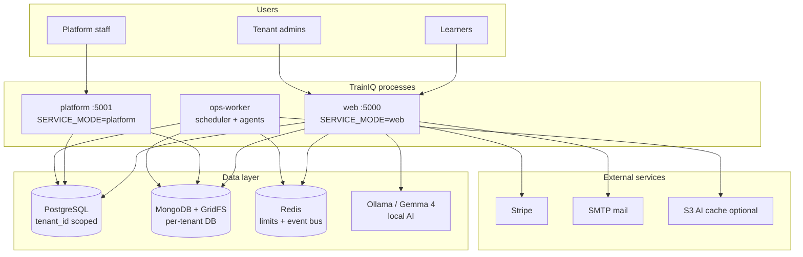

---

## How the system works

### Deployment topology

Production runs **three processes** from the same Docker image. Each process sets `SERVICE_MODE` so only the relevant Flask blueprints register.

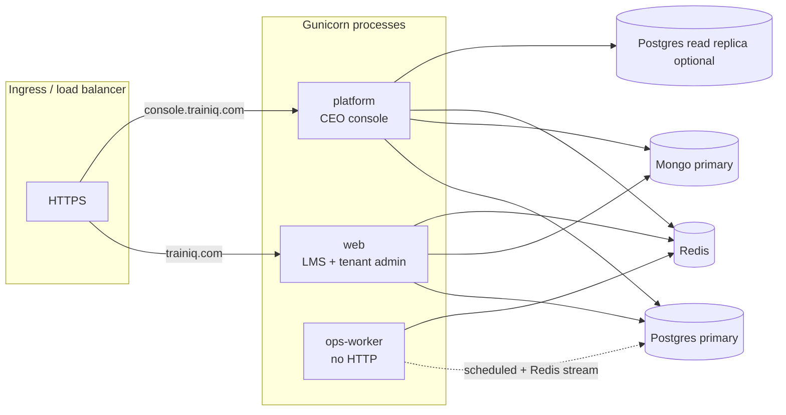

| Process | `SERVICE_MODE` | `RUN_SCHEDULER` | `EVENT_BUS_CONSUMER` | Serves |
|---------|----------------|-----------------|----------------------|--------|
| LMS web | `web` | `false` | `false` | Courses, exams, admin, billing |
| CEO console | `platform` | `false` | `false` | `/platform/*`, support enter |
| Ops worker | `full` | `true` | `true` | APScheduler jobs, agent actions |
| Local dev | `full` | optional | optional | Everything on one port |

See [DEPLOYMENT.md](DEPLOYMENT.md) for Docker Compose, preflight, and observability stack.

---

### Request lifecycle

Every HTTP request passes through shared middleware before reaching a blueprint route.

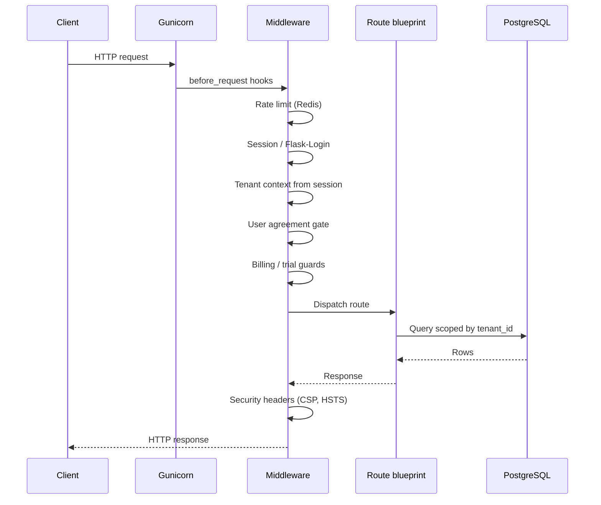

**Key middleware concerns** (`app.py`):

1. **Rate limiting** — Flask-Limiter backed by Redis (in-memory fallback in dev)
2. **Authentication** — Flask-Login session; `tenant_id` stored in session
3. **Tenant scoping** — routes filter by `session['tenant_id']` or `current_user.tenant_id`
4. **Legal gate** — users must accept current agreement version
5. **Trial / billing** — expired trials block non-admin logins
6. **Security headers** — CSP, HSTS (production), X-Frame-Options

---

### Tenant onboarding flow

New organizations can register via `/auth/onboarding` or `/auth/register` (new company path).

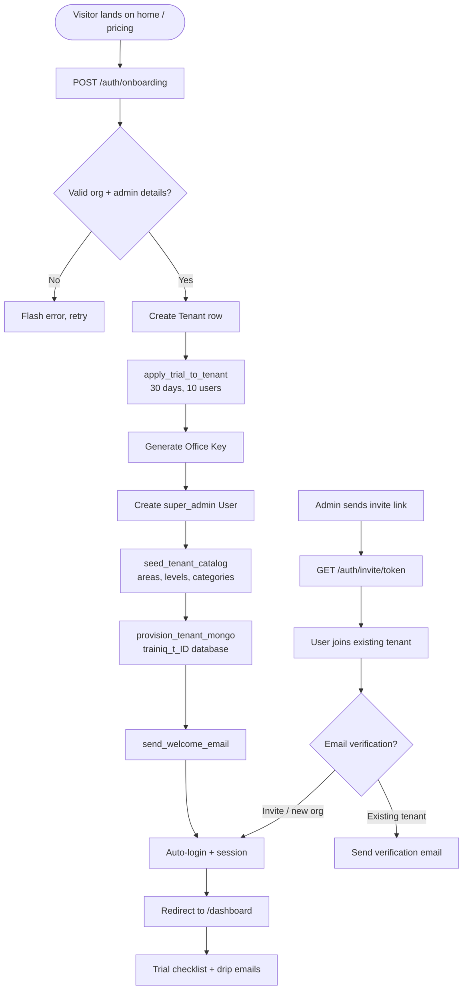

**Artifacts created per tenant:**

| Step | What is created |
|------|-----------------|
| Postgres | `tenants`, `users`, `clients`, seeded catalog tables |
| MongoDB | Database `trainiq_t_<id>` for GridFS uploads |
| Session | `tenant_id`, `tenant_name`, Office Key shown once |
| Billing | `plan=trial`, `trial_ends_at`, `max_users=10` |

---

### Authentication flow

Login is **Office Key + email + password** (tenant-scoped). Platform staff use the `TRAINIQ` office key.

```mermaid
flowchart TD
  LOGIN[POST /auth/login] --> KEY{Valid Office Key?}
  KEY -->|No| FAIL1[Invalid key]
  KEY -->|Yes| TENANT[Load Tenant]
  TENANT --> PLAT{TRAINIQ key?}
  PLAT -->|Yes, not staff| FAIL2[Staff-only key]
  PLAT -->|No or staff| USER[Find user by email + tenant]
  USER --> PWD{Password correct?}
  PWD -->|No| LOCK[Increment failed_login_count<br/>audit FAILED_LOGIN]
  PWD -->|Yes| VER{Email verified?}
  VER -->|No| RESEND[Resend verification]
  VER -->|Yes| TRIAL{Trial expired?}
  TRIAL -->|Yes, not admin| BLOCK[Trial expired message]
  TRIAL -->|No or admin| BILL{Past due billing?}
  BILL -->|Blocked| BLOCK2[Billing message]
  BILL -->|OK| SESS[prepare_login_session]
  SESS --> TOTP{2FA required?}
  TOTP -->|Yes| MFA[/auth/verify_2fa]
  TOTP -->|No| OK[login_user → dashboard]
  MFA --> OK

  SSO[GET /auth/sso/start] --> IDP[Redirect to OIDC IdP]
  IDP --> CB[/auth/sso/callback]
  CB --> MATCH[Match email to tenant user]
  MATCH --> SESS
```

**Session contents after login:**

```
session['tenant_id']     → active tenant
session['tenant_name']   → display branding
session['_user_id']      → Flask-Login
platform_support flag    → set when CEO enters customer tenant
```

---

### Tenant data isolation

Isolation is enforced at **three layers** — not just a UI filter.

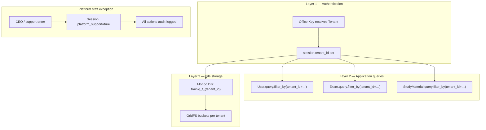

| Store | Isolation mechanism |
|-------|---------------------|
| PostgreSQL | `tenant_id` FK on users, exams, courses, tasks, scores, … |
| MongoDB | Separate database per tenant (`MONGO_TENANT_DB_PREFIX`) |
| Redis | Key prefixes for rate limits; event bus is platform-wide |
| AI cache | Cache keys include tenant + content hash |
| Stripe | `stripe_customer_id` on `tenants` row |

Cross-tenant access attempts return 404 or flash errors — never another tenant's data.

---

### Learner journey

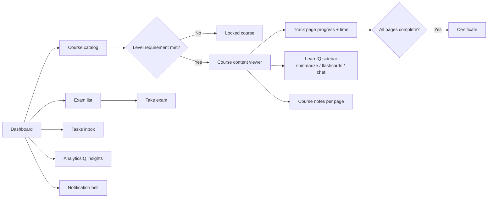

**Level gating** (`utils/level_access.py`) — courses and exams can require a minimum designation level. Progress is tracked per user per course in Postgres; file content is streamed from GridFS.

---

### Exam & ProctorIQ flow

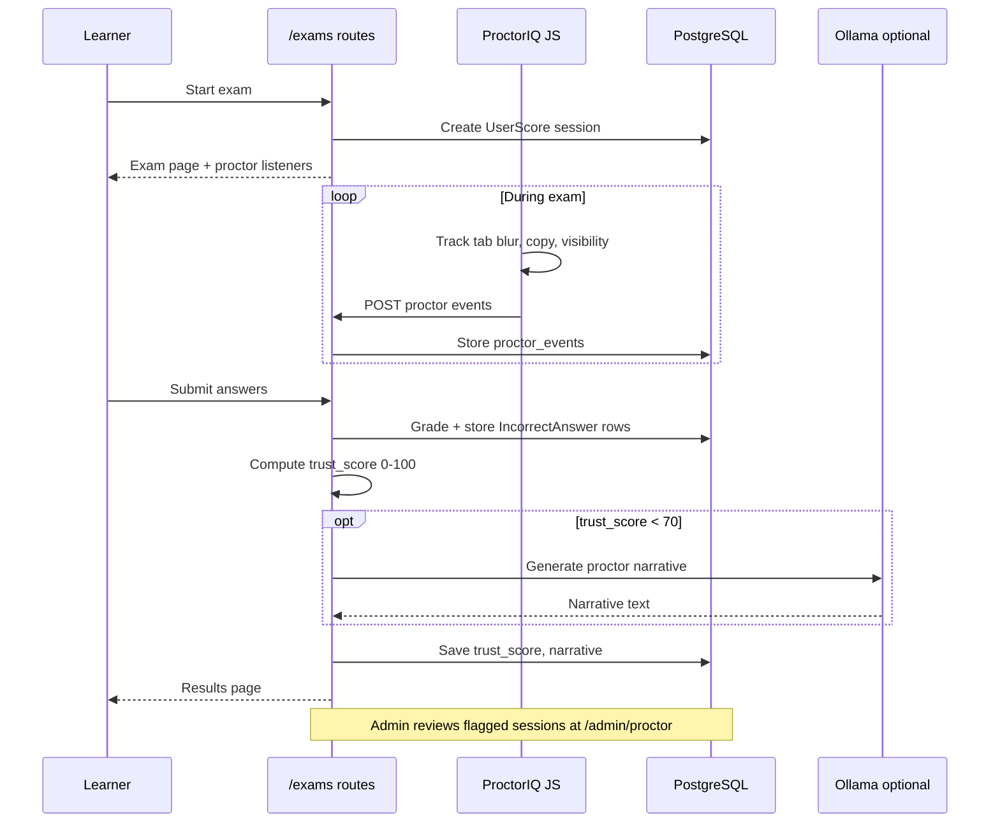

| Trust signal | Effect on score |
|--------------|-----------------|
| Tab switches / blur events | Decreases trust |
| Copy attempts | Decreases trust |
| Normal completion | Higher trust |
| Score < 70 | Flagged for admin review |

---

### AI pipeline

All AI runs **locally via Ollama** — no OpenAI/Anthropic API keys required.

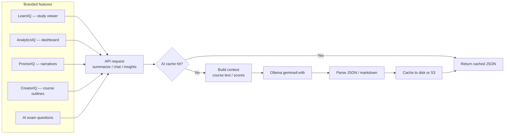

| Feature | Endpoint | Input |
|---------|----------|-------|
| LearnIQ summarize | `POST /study_materials/ai/summarize/<id>` | GridFS document text |
| LearnIQ chat | `POST /study_materials/ai/chat/<id>` | Document + user message |
| AnalyticsIQ | `GET /ai/performance-insights` | UserScore + IncorrectAnswer history |
| CreatorIQ | `POST /admin/courses/generate-outline` | Admin prompt |
| Exam AI | Admin exam builder | Topic prompt |

Setup: [walkthrough.md](walkthrough.md) · Strategy: [ai_feature_strategy.md](ai_feature_strategy.md)

---

### Billing & subscription flow

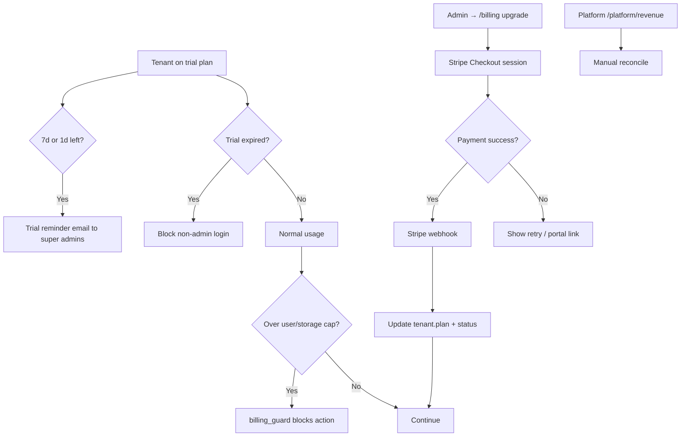

| Plan | Max users | Storage | Price |
|------|-----------|---------|-------|
| Trial | 10 | 2 GB | Free 30 days |
| Starter | 20 | 5 GB | $49/mo |
| Growth | 75 | 25 GB | $149/mo |
| Business | 200 | 100 GB | $349/mo |
| Enterprise | Custom | Custom | Contact sales |

Configure Stripe Price IDs in `.env` (`STRIPE_PRICE_*`).

---

### Platform support mode

CEO and platform staff can **enter a customer tenant** for support without sharing passwords.

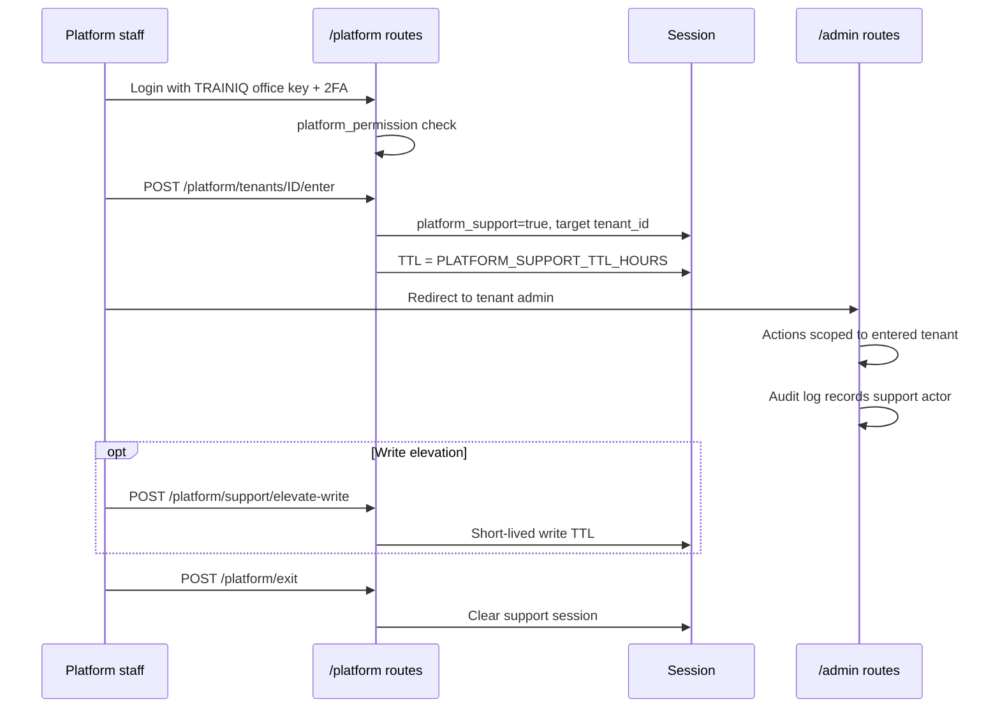

---

### Ops worker & event bus

Background operations run outside the web request path to avoid blocking learners.

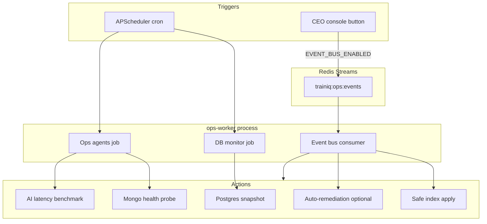

CEO agent actions from `/platform/operations` are **queued to Redis** when `EVENT_BUS_ENABLED=true`; the ops worker executes them via `execute_agent_action_sync`.

---

## Feature catalog

### Learning & content

| Feature | Description |
|---------|-------------|
| Study materials | PDF, DOCX, PPTX, TXT, YouTube embed, SCORM |
| Course progress | Page-level tracking, time-on-page, level gates |
| Course notes | Per-page notes, full-text search, export |
| SCORM import | Package upload and progress tracking |
| Certificates | PDF completion certificates |
| Learner recommendations | Gap-based course suggestions |
| PWA | Service worker for offline shell |

### Exams & assessment

| Feature | Description |
|---------|-------------|
| Standard exams | Timed, auto-graded, multiple attempts |
| Special exams | Paper 1 & Paper 2 tenant-scoped workflows |
| Custom builder | Admin-authored question sets |
| AI generation | Ollama-powered question creation |
| Exam retry rules | Configurable cooldowns and limits |
| ProctorIQ | Trust score, event tracking, admin review |
| Incorrect-answer log | Per-question remediation analytics |
| Exam access requests | Learner request → admin approve |

### Tasks, HR & admin

| Feature | Description |
|---------|-------------|
| Task management | Priorities, due dates, attachments |
| HR / org structure | Departments, designations, levels |
| Granular admin permissions | Per-admin capability flags |
| Announcements | Org-wide in-app messages |
| Analytics dashboard | Charts + CSV export |
| Admin tools grid | Unified admin navigation |

### AI suite (local — no cloud API keys)

| Brand | Capability |
|-------|------------|
| **LearnIQ** | Summarize, flashcards, grounded chat |
| **AnalyticsIQ** | Weakness diagnosis from score history |
| **ProctorIQ** | Trust scoring + AI review narrative |
| **CreatorIQ** | Course outline wizard |
| **Exam AI** | Question generation from prompts |

### Platform & billing

| Feature | Description |
|---------|-------------|
| CEO dashboard | MRR, tenant counts, health |
| Tenant management | Suspend, plan change, GDPR purge |
| Stripe billing | Checkout, webhooks, portal |
| Trial lifecycle | Reminders, expiry, upgrade prompts |
| Platform staff | Invites, roles, mandatory 2FA |
| Ops console | DB/Mongo/AI health, agent actions |
| Observability | Prometheus, Grafana, Alertmanager |

---

## SaaS plans

| Plan | Users | Storage | Monthly |
|------|-------|---------|---------|
| Trial | 10 | 2 GB | Free (30 days) |
| Starter | 20 | 5 GB | $49 |
| Growth | 75 | 25 GB | $149 |
| Business | 200 | 100 GB | $349 |
| Enterprise | Custom | Custom | Contact sales |

---

## Tech stack

| Layer | Technology |
|-------|------------|
| Backend | Python 3.11+, Flask 2.3+ |
| ORM | SQLAlchemy 2, Flask-Migrate, Alembic |
| Primary DB | PostgreSQL 15 |
| Files | MongoDB 7 + GridFS (per-tenant DBs) |
| Cache / queue | Redis 7 |
| AI | Ollama + Gemma 4 (`gemma4:e4b`) |
| Payments | Stripe |
| Email | Flask-Mail (SMTP) |
| WSGI | Gunicorn |
| Containers | Docker Compose |
| Metrics | Prometheus + Grafana |
| CI | GitHub Actions |

---

## Getting started

### Prerequisites

- Python 3.11+
- PostgreSQL 15
- MongoDB 7 (optional — uploads disabled without it)
- Redis 7 (optional in dev)
- [Ollama](https://ollama.com) + `gemma4:e4b` for AI

### Clone & run

```bash
git clone https://github.com/Thanuka9/TrainIQ.git
cd TrainIQ

python -m venv env
env\Scripts\activate          # Windows
# source env/bin/activate     # macOS/Linux

pip install -r requirements.txt
cp .env.example .env          # set DATABASE_URL, SECRET_KEY, mail
flask db upgrade
python app.py
```

Open http://localhost:5000

### Verify AI

```bash
ollama pull gemma4:e4b
python -c "from utils.local_ai import get_ai_status; import json; print(json.dumps(get_ai_status(), indent=2))"
```

### Multi-process local dev

```bash
# Terminal 1 — LMS
set SERVICE_MODE=web && python scripts/run_web.py

# Terminal 2 — CEO console
set SERVICE_MODE=platform && set PORT=5001 && python scripts/run_web.py

# Terminal 3 — ops worker
set RUN_SCHEDULER=true && set OPS_WORKER_MODE=true && python scripts/run_ops_worker.py
```

---

## Production deployment

```bash
cp .env.production.example .env
python scripts/production_preflight.py --generate-secret
python scripts/production_preflight.py
flask db upgrade
gunicorn -c gunicorn.conf.py app:app
```

Full guide: **[DEPLOYMENT.md](DEPLOYMENT.md)** · Smoke test: **[STAGING_SMOKE_TEST.md](STAGING_SMOKE_TEST.md)**

Docker full stack:

```bash
docker compose -f docker-compose.prod.yml up -d --build
```

---

## Testing & CI

```bash
pytest tests/ -q
python scripts/verify_infrastructure.py
python scripts/production_preflight.py --skip-connectivity
python scripts/load_smoke.py --url http://localhost:5000 --requests 50
```

GitHub Actions runs migrations + pytest on push (`.github/workflows/`).

---

## Project structure

```
TrainIQ/
├── app.py                     # Flask factory, middleware, blueprint registration
├── models.py                  # SQLAlchemy models
├── auth_routes.py             # Login, register, onboarding, SSO, 2FA
├── admin_routes.py            # Tenant administration
├── platform_routes.py         # CEO console
├── study_material_routes.py   # Courses + LearnIQ
├── exams_routes.py            # Exams + ProctorIQ
├── billing_routes.py          # Stripe + plans
├── utils/                     # Business logic (billing, ops, AI, security, …)
├── templates/                 # Jinja2 HTML
├── static/                    # CSS, JS, PWA assets
├── migrations/                # Alembic versions
├── tests/                     # Pytest (350+ tests)
├── scripts/                   # run_web, ops worker, preflight, smoke
├── deploy/observability/      # Prometheus, Grafana, Alertmanager
├── docker-compose.*.yml
├── Dockerfile
├── gunicorn.conf.py
└── DEPLOYMENT.md
```

### Route map

| Blueprint | Prefix | Purpose |
|-----------|--------|---------|
| `auth_routes` | `/auth` | Login, register, onboarding, SSO, invites |
| `general_routes` | `/` | Home, dashboard, legal pages |
| `study_material_routes` | `/study_materials` | Courses, LearnIQ, notes |
| `exams_routes` | `/exams` | Exams, grading, ProctorIQ |
| `special_exams_routes` | `/special_exams` | Paper 1 & 2 |
| `task_routes` | `/tasks` | Task management |
| `admin_routes` | `/admin` | Tenant admin |
| `billing_routes` | `/billing` | Plans, Stripe checkout |
| `platform_routes` | `/platform` | CEO console |
| `notification_routes` | `/notifications` | In-app bell |
| `ai_routes` | `/ai` | AnalyticsIQ |
| `management_routes` | `/management` | HR structure |
| `profile_routes` | `/profile` | User profile |

---

## Documentation index

| Document | Contents |
|----------|----------|
| [DEPLOYMENT.md](DEPLOYMENT.md) | Production architecture, Docker, env vars |
| [STAGING_SMOKE_TEST.md](STAGING_SMOKE_TEST.md) | Pre-release checklist |
| [walkthrough.md](walkthrough.md) | AI setup and feature tour |
| [ai_feature_strategy.md](ai_feature_strategy.md) | AI positioning and API map |
| [.env.example](.env.example) | Development configuration |
| [.env.production.example](.env.production.example) | Production configuration |

---

## Security & compliance

| Control | Implementation |
|---------|----------------|
| Tenant isolation | `tenant_id` on all queries; per-tenant Mongo DB |
| Authentication | Office Key + email + password; optional OIDC SSO |
| 2FA | TOTP for platform staff (`pyotp`) |
| Rate limiting | Redis-backed Flask-Limiter |
| Audit trail | `audit_log` table |
| GDPR | Tenant anonymize + optional storage purge |
| Legal | Versioned user agreement gate |
| Production guards | Preflight script, schema freeze, real Redis required |
| Headers | CSP, HSTS, X-Frame-Options, Permissions-Policy |

---

## Branch workflow

| Branch | Purpose |
|--------|---------|
| `main` | Stable releases |
| `develop` | Integration |
| `feature/*` | Individual work |

---

## Legal

TrainIQ is operated by **Veyra Labs**. Configure legal entity and contacts via `.env` (`TRAINIQ_LEGAL_*`).

- Website: https://trainiq.com
- Support: support@trainiq.com
- Repository: https://github.com/Thanuka9/TrainIQ
